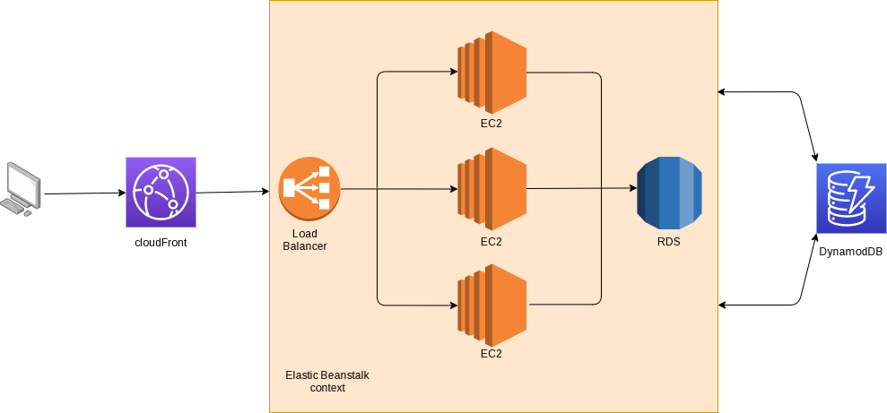

# High Level Design Documentation

Currently, the application is quite simple and we don't need to use complex architecture and high level services.

That said, In a scalability mindset we will use an architecture which is currently non-necessary but allow us a well evolution.

The [datamodel](../datamodel/datamodel.md) is explained in another place.

## Architecture

The described architecture is temporary.

There are two differents considered methods to build our application core. This part is only for user access and interactions.

The first way, using `AWS Elastic Beanstalk`.

The second, using `Amazon S3` as website host and `AWS lambda` for the backend.

_So far, we are using the second way._

Then for the purposed scheduling we are using an other context, like follow.

