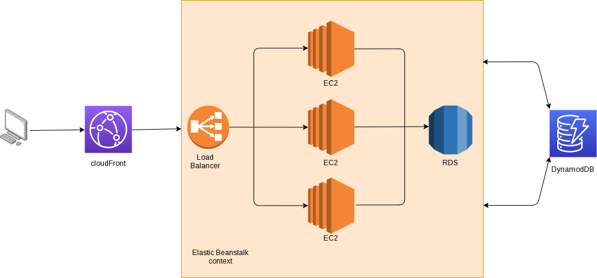
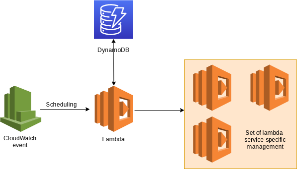

# High Level Design Documentation

Currently, the application is quite simple and we don't need to use complex architecture and high level services.

That said, In a scalability mindset we will use an architecture which is currently non-necessary but allow us a well evolution.

The [datamodel](../datamodel/datamodel.md) is explained in another place.

## Architecture

The described architecture is temporary.

We are using the `AWS Elastic Beanstalk` for the application core. This part is only for user access and interactions.

Then for the purposed scheduling we are using an other context, like follow.

