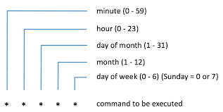

# Low Level Design Documentation

A big part of the low level design is explained respectively in frontend and backend directories.

| Path             | Reference                                      |
|------------------|------------------------------------------------|
| `src/frontend`   | [frontend lld](../../src/frontend/README.md)   |
| `src/backend`    | [backend lld](../../src/backend/README.md)     |

## Scheduling design

The choosen scheduling expression is [cron](https://en.wikipedia.org/wiki/Cron). This way isn't very user friendly but usefull.

The cron syntax is used like follow (same as AWS but without the _year_).

You can generate `crontab` from usual time expression [here](http://www.cronmaker.com/;jsessionid=node09k01z1ykrkway23h9dfleke363930.node0?0).