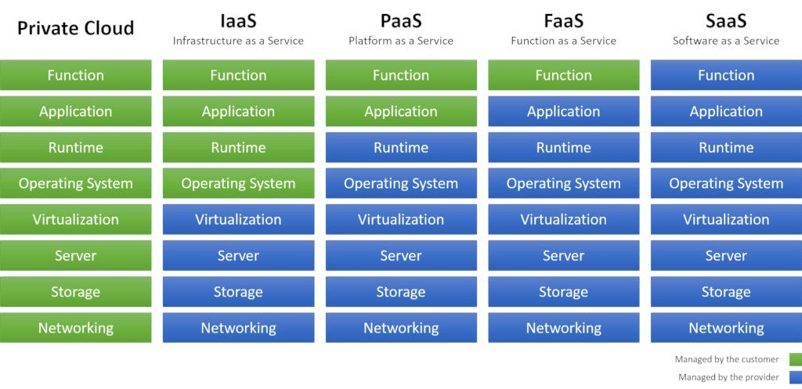

# Root Project Documentation

ParadigmShift is a high level target scheduler.

This is little personnal project without any ambition.

## The Cloud

Working with a [cloud provider](https://fr.wikipedia.org/wiki/Cloud_computing) as [AWS](https://en.wikipedia.org/wiki/Amazon_Web_Services) change many things.

This is a universe where the automatation is taken to the extreme and the end user work is highly reduced.

The `As A Service` concept.

The Cloud can offer to the user an abstraction on the manipulated objects.

In this mindset and working around `AWS` universe this project was born.

## A scheduler... for what ?

The central idea is that you can affect the differents ressources with your own rules using principaly scheduling services (low level scope) and [lambda functions](https://en.wikipedia.org/wiki/AWS_Lambda).

The purpose of `ParadigmShift` is to raise the target scope level from `resource` to `application`.

Then, you will be allowed to schedule entire applications with your own rules.

Due to the target level, the only scheduling will be a power on/off of the application.

Probably some additionnal resource operation specific will be implemented.

## About the documentation

As a well documented project, we will describe the [High Level Design](https://en.wikipedia.org/wiki/High-level_design) and then the [Low Level Design](https://en.wikipedia.org/wiki/Low-level_design).

Some explaination about the datamodel which will evolve without any doubt.

All the documentation is wroten in MarkDown so far but an other one will be provided later.

| Path                               | Reference                                                         |
|------------------------------------|-------------------------------------------------------------------|
| `doc/design/hld.md`                | [High Level Design documentation](design/hld.md)                  |
| `doc/design/lld.md`                | [Low Level Design documentation](design/lld.md)                   |
| `doc/datamodel/datamodel.md`       | [Data Model documentation](datamodel/datamodel.md)                |