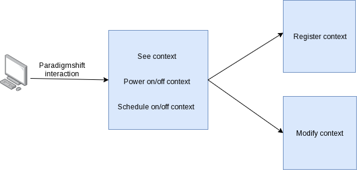
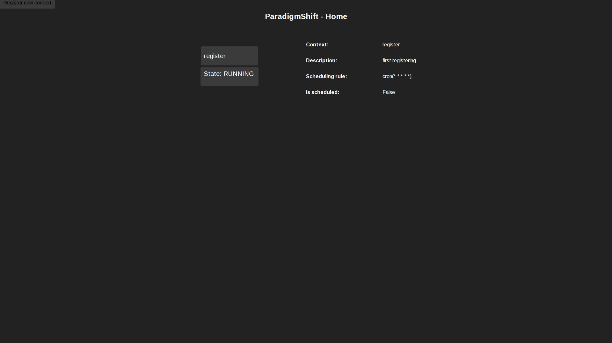
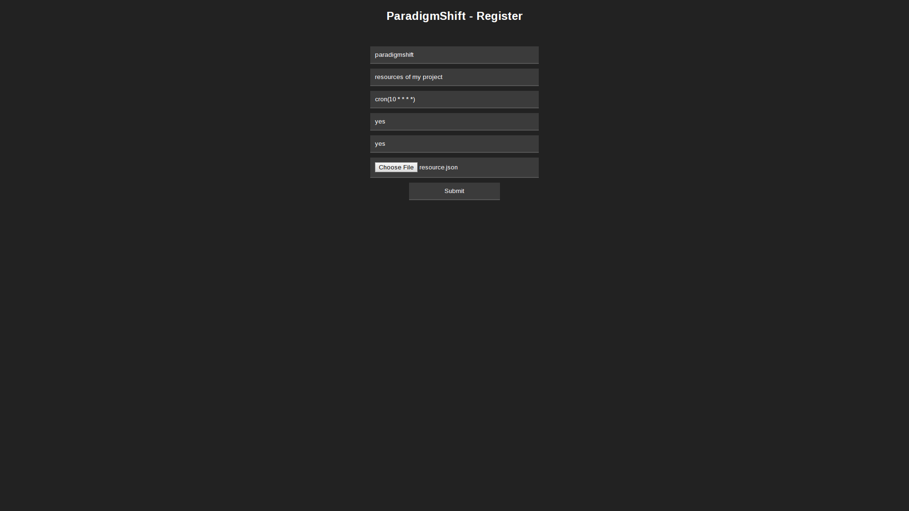

# Frontend documentation

As explained in the design documentation, we are actually using an `Amazon S3` to host static website.

The front is actually simple so far and composed only of hand made *HTML/CSS*.

## User access flow



## Page Description

Got four pages to handle the necessary.

### Root Page

This page is basicaly the entry point of the website.

All the registered applications are displayed.

You can then target a particular one to apply modification.



### Context Registering Page

This page is dedicated to the registering of an application.



All the fields are explicited in the datamodel documentation.

The field 'file' in the resgistering desire a file with JSON format describing the context resources.

Example of the file 'resources.json'

```javascript
{
    "ec2:instance": {
        "id" : ["ec2id1", "ec2id2"],
        "isScheduled": [true, false],
        "attrib": ["", ""]
    },
    "rds:instance": {
        "id" : ["rdsid1"],
        "isScheduled": [true],
        "attrib": [""]
    }
}
```

### Tag Registering Page (not implemented yet)

### Modifying Page (not implemented yet)

Only for modifying existing context.
